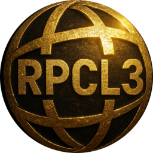

# RPCS3 Priority Control Launcher - RPCL3

**Launcher(s) for RPCS3.**               

**Features:**
Set process priority.
Capture video (to rpcl3_captures folder).
Includes video player.
Capture Audio (to rpcl3_recordings).
Includes music player.
Capture screenshots (to rpcl3_screenshots folder).
Switch screen between monitor 1 and 2 (in case you have 2 monitors).
Position screen with configurable steps.
Search game in database and load the selected game.
Play Atrac3 sound.
Convert Atrac3 to .wav.
Show rpcs3 version.
Show rpcs3 help.
Add game icon ICON0.PNG to database.
Download latest version of rpcs3.
Download and install FFMPEG and option to set it to your PATH.

